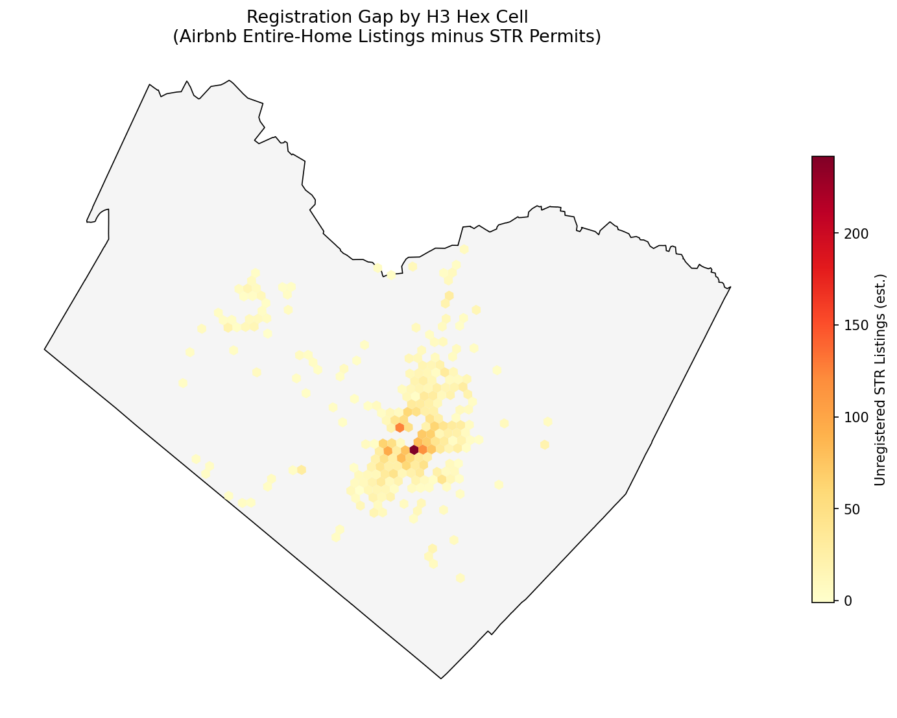
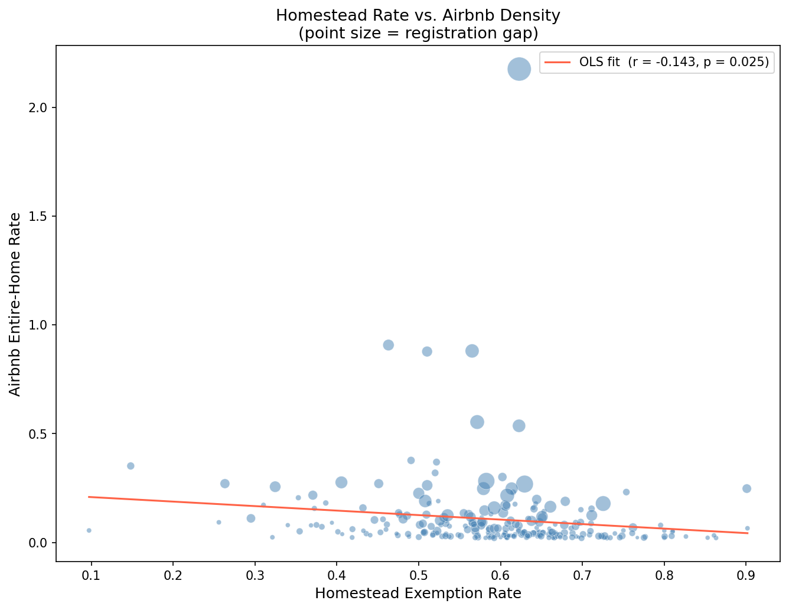

# Travis County Homestead Exemption — STR Fraud Analysis

A spatial proof-of-concept pipeline identifying neighborhoods where short-term rental activity coincides with homestead exemption claims in Travis County, Texas.

---

## Key Findings



| Metric | Value |
|---|---|
| Hex cells analyzed | 246 |
| Homestead rate vs. Airbnb density | r = −0.143 (p = 0.025) |
| Largest registration gap (single cell) | 242 unregistered listings |
| Airbnb listings vs. STR permits (county-wide) | 7,082 vs. 987 |

The aggregate spatial signal is weak by design — STR fraud is a parcel-level phenomenon that hex-cell averaging dilutes. This pipeline establishes the methodology and identifies candidate neighborhoods for parcel-level follow-up with better data.



---

## Data Sources

| Dataset | Source |
|---|---|
| TCAD property tax export (~29GB) | Travis County Appraisal District |
| STR permit locations | City of Austin Open Data Portal |
| Airbnb listings | Inside Airbnb |
| Travis County boundary | U.S. Census TIGERweb REST API |

---

## Pipeline

```
python main.py
```

| Stage | Script | Output |
|---|---|---|
| 0 — Preflight | `stage0_preflight.py` | Checks SQLite DB is ready |
| 1 — Ingest | `load_protax_to_sqlite.py` | `travis_property_tax.db` (~1.1GB) |
| 2 — Aggregate | `aggregate_to_hex.py` | `hex_ratios.geojson` (246 cells) |
| 3 — Visualize | `visualize.py` | 3 figures + 2 CSVs |

Stage 1 is skipped automatically if the database already exists. Run `scripts/fetch_tcad.py` once beforehand to download the raw TCAD export.

---

## Outputs

| File | Description |
|---|---|
| `map_homestead_airbnb.png` | Side-by-side choropleth: homestead rate vs. Airbnb density |
| `map_registration_gap.png` | Unregistered STR listings per hex cell |
| `scatter_homestead_vs_airbnb.png` | Scatter with OLS fit; point size = registration gap |
| `correlation_summary.csv` | Pearson + Spearman correlations for all variable pairs |
| `candidate_neighborhoods.csv` | Top 25 hex cells by registration gap |

---

## Setup

Requires [Miniconda](https://docs.conda.io/en/latest/miniconda.html) installed to the default user directory.

```
git clone <repository-url>
cd property_tax_project
boot_dev_env.bat
```

`boot_dev_env.bat` creates and activates a conda environment from `environment.yml` (Python 3.12). On subsequent runs it just activates the existing environment.

---

## Project Structure

```
property_tax_project/
├── main.py                        # Full pipeline entry point
├── scripts/
│   ├── fetch_tcad.py              # One-time data download (run before main.py)
│   ├── load_protax_to_sqlite.py   # Stage 1
│   ├── aggregate_to_hex.py        # Stage 2
│   ├── visualize.py               # Stage 3
│   ├── stage0_preflight.py
│   ├── stage1_output_test.py
│   └── stage2_output_test.py
├── images/                        # Committed output figures
├── data/
│   ├── sources/                   # Raw inputs and SQLite DB (gitignored)
│   └── products/                  # Pipeline outputs (gitignored)
├── docs/                          # Methodology and pitch documents
├── environment.yml
└── boot_dev_env.bat
```
